# Auxilium: Revolutionizing Volunteering Platforms

## Project Overview

**Auxilium** is an innovative first-year team project undertaken by a dedicated group of six individuals. The mission is to create a cutting-edge volunteering website with features designed to enhance user experience, streamline event organization, and promote community engagement and social impact.

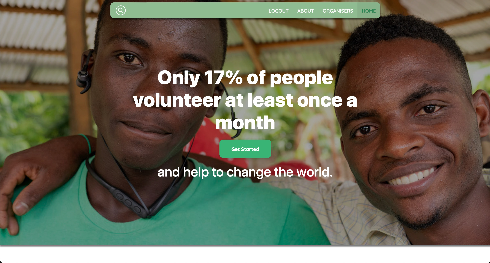

## Key Features

### 1. Organization Home Page
The organization home page serves as a central hub, providing a visually appealing and user-friendly interface for different volunteering groups. This ensures a seamless navigation experience for users seeking to engage with various organizations.

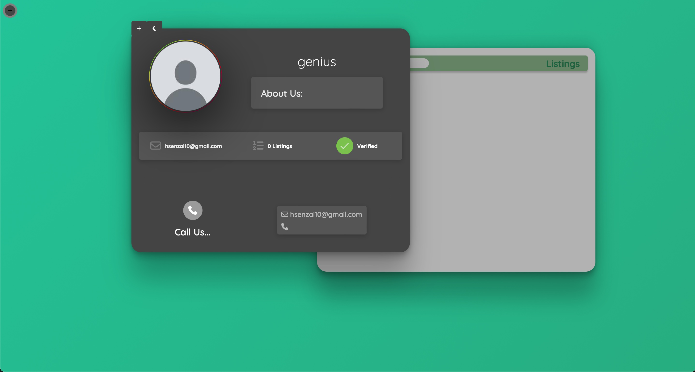
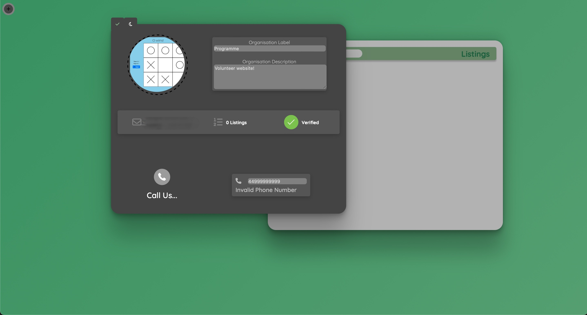

### 2. Event Creation Platform
Auxilium facilitates the creation of new events through a feature-rich platform. Users can input event details such as location, descriptions, and more. The intuitive design ensures a straightforward process for event organizers.

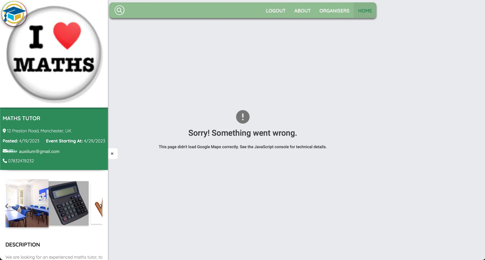

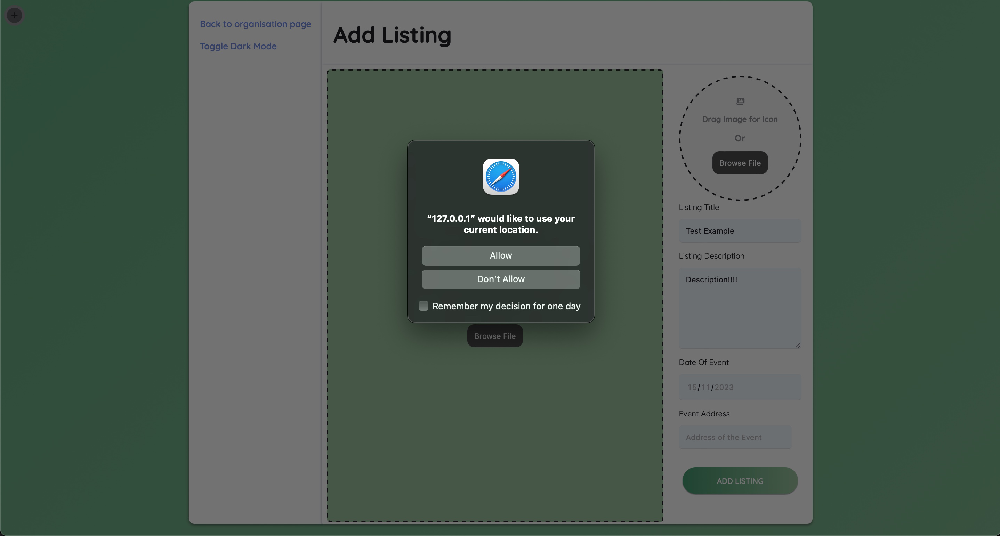

### 3. List of Events
Discovering and participating in events is made easy through a comprehensive list of activities posted by various organizations. Users can explore diverse opportunities and find events that align with their interests.

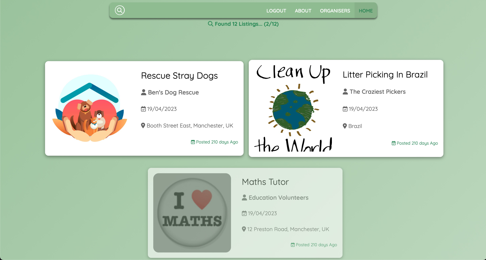
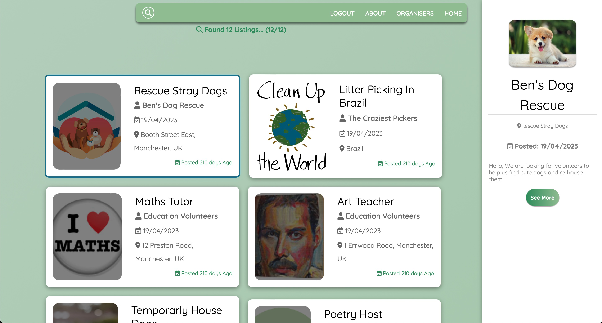

### 4. User Account Creation
Creating accounts is a breeze with Auxilium's straightforward signup process. Organizations can register using their email addresses, ensuring a secure and personalized experience on the platform.

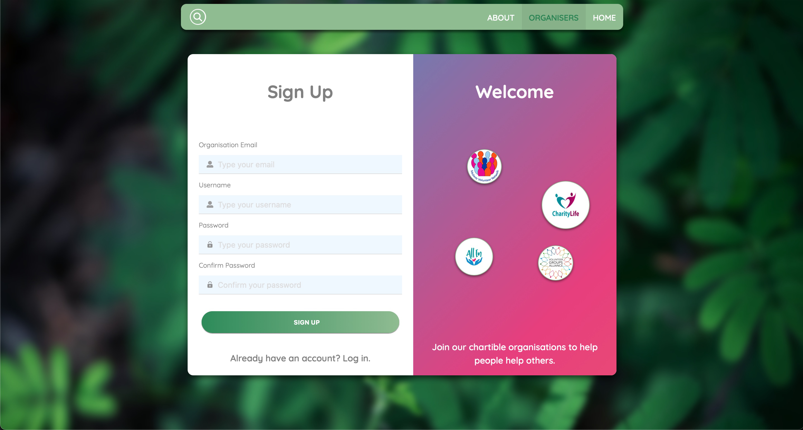
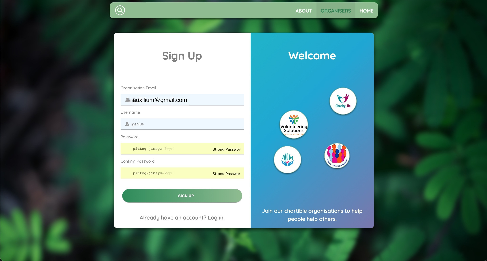

### 5. Two-Factor Authentication (2FA)
Prioritizing security, Auxilium incorporates Two-Factor Authentication (2FA) through email verification, adding an extra layer of protection to user accounts.

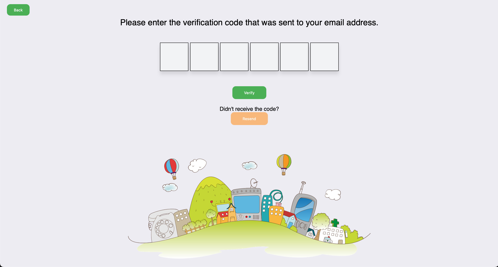
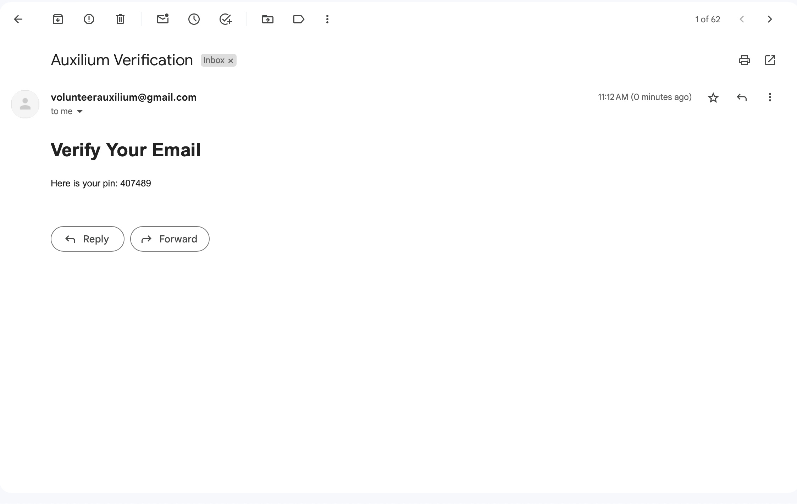

## Technical Insights
The robust backend of Auxilium is complemented by a sleek terminal interface, showcasing the project's technical prowess and commitment to efficient development practices.

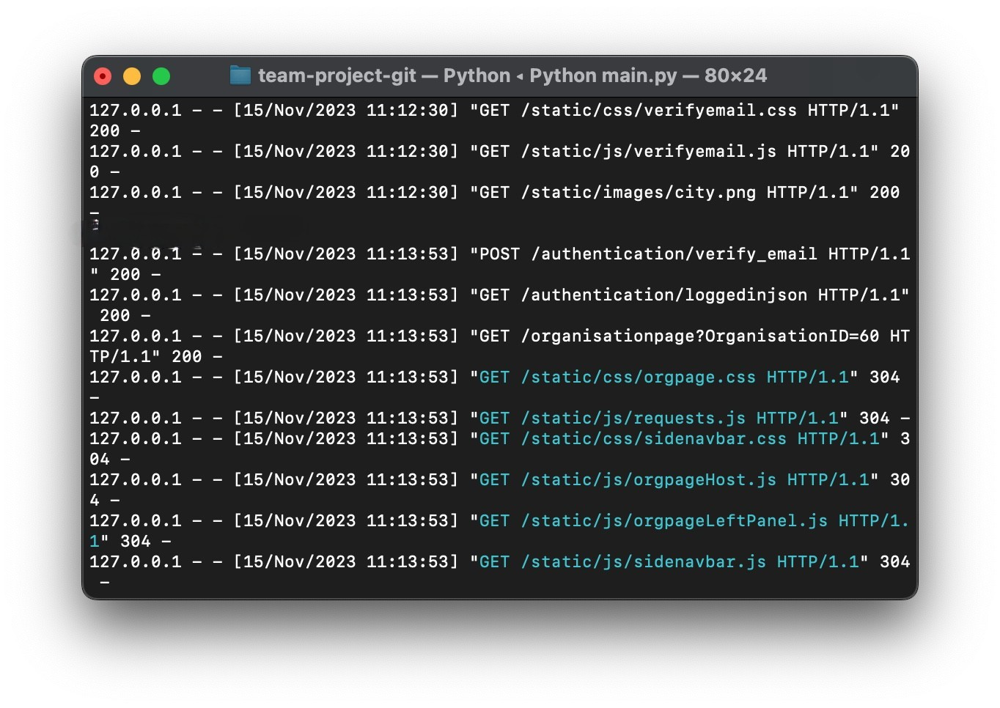

## Summary
Auxilium, meaning help, aid, and assist in Latin, stands as a testament to the synergy of a passionate team committed to revolutionizing the volunteering experience. Through a harmonious blend of user-friendly design and advanced features, Auxilium is more than just a project; it's a catalyst poised to proliferate volunteering by leveraging its innovative platforms.
