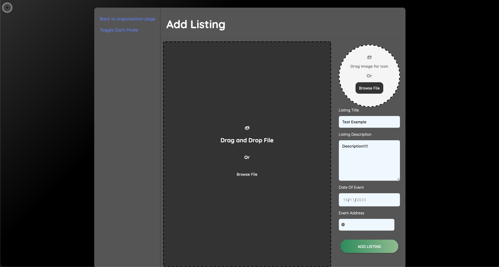

# Auxilium

Auxilium is a first year team project we worked on in a group of six people. The website is about creating new volunteering websites, with features such as 

2. Posting new events and editing them, as well as uploading pictures of what the events would be

Page about the organisation home page

Create a new event, with locations, description, etc.

has a bunch of events that other organisation posted

- Creating accounts using emails.

- 2FA

